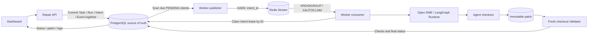

# Reliable Repo Repair

**Make repository repair traceable, recoverable, and independently verifiable.**

[中文](README.md) · [Project showcase](docs/site/index.html) · [Features](#features) · [Architecture](#system-architecture) · [Quick start](#quick-start)


Reliable Repo Repair integrates task management, Agent execution, patch storage, and independent validation. Users submit a repository fixture, an exact commit SHA, and a failing command. The system dispatches the task, executes code changes, exports a candidate patch, validates it in a fresh checkout, and exposes task status, patch bytes, and logs.

FastAPI, a standalone Repair Worker, LangGraph Runtime, PostgreSQL, Redis Streams, and a React Dashboard run through a five-service Docker Compose configuration.

## Features

| Capability | Implementation |
| --- | --- |
| Task lifecycle | Separate Task / Run / Event records, deadlines, and Runtime references |
| Idempotent creation | Owner-scoped `Idempotency-Key`; conflicting payloads return `409` |
| Durable dispatch | Transactional Task / Run / Intent creation in PostgreSQL; Redis Stream delivery of Intent IDs; database leases, fencing tokens, and bounded retry |
| Standalone Worker | Dispatch, observation, candidate collection, validation, and recovery outside the API lifecycle |
| Immutable candidates | Exact base commit, original patch bytes, SHA-256, and database-enforced immutability |
| Independent validation | Fresh checkout, baseline failure, patch check/apply, fixed target and regression commands |
| Recovery | Lease takeover after Worker restart, Runtime identity reconciliation, and token-fenced result writes |
| Dashboard | Task creation/list/pagination plus timeline, Run references, read-only diff, and validation logs |

## System architecture



The API and Runtime run in `backend`. The separate `repair-worker` calls the Runtime API and shares the local workspace volume with backend. PostgreSQL owns task and dispatch state; Redis Streams delivers Intent IDs, and consumers claim execution leases in PostgreSQL. Independent validation `PASS` advances the task to `COMPLETED`.

| Service | Responsibility |
| --- | --- |
| `dashboard` | Task creation, pagination, status polling, diff, and validation logs |
| `backend` | Session authentication, Repair API, migrations, and LangGraph Agent Runtime |
| `repair-worker` | Dispatch, observation, candidate collection, validation, and lease takeover |
| `postgres` | Tasks, Runs, dispatch intents, events, candidate patches, and validation records |
| `redis` | Stream delivery, consumer groups, and pending-message takeover; local AOF persistence |

PostgreSQL persists each Intent while Redis Stream delivers messages with at-least-once semantics. A failed `XADD` is retried from the pending Intent. Database row locks and leases collapse duplicate deliveries; `XAUTOCLAIM` transfers pending messages after a consumer crash. The publisher rebuilds a lost Stream from pending Intents, and Runtime metadata supports reconciliation of unknown creation outcomes.

## Task execution

1. **Submit:** validate the authorized fixture, exact SHA, failing command, constraints, and idempotency key.
2. **Enqueue:** persist Task, Run, DispatchIntent, and initial events in one transaction; return `202`.
3. **Deliver:** scan pending Intents, publish `intent_id` to Redis Stream, and read or reclaim the message through its consumer group.
4. **Execute:** claim the Intent lease by ID in PostgreSQL and start the Agent through the Runtime API in a separate workspace.
5. **Collect:** export and store patch bytes, exact base commit, SHA-256, and changed files.
6. **Validate:** reproduce the failure in a fresh checkout, check/apply the patch, and run fixed target and regression commands.
7. **Inspect:** read final status, patch, events, and validation logs through the Dashboard or API.

The success path is `RECEIVED → QUEUED → PROVISIONING → VALIDATING → COMPLETED`. `FAILED` and `TIMEOUT` are terminal states.

## Screenshots

Actual screenshots from an `arithmetic` fixture run, showing task creation, patch output, and validation results.

| Create and list tasks | Patch and validation evidence |
| --- | --- |
|  |  |

## Quick start

Clone your copy of this repository and run from its root. Requires **Docker Compose v2** and **Python 3.9+** for private configuration generation. Application Python 3.14 and frontend build tools are provided by the Dockerfiles.

```bash
# First run only; retain an existing .env.repair
python3 scripts/repair_init.py
docker compose --env-file .env.repair -f compose.repair.yaml up --build -d --wait --wait-timeout 180
```

This starts `postgres`, `redis`, `backend`, `repair-worker`, and `dashboard`. Default UI: `http://127.0.0.1:3012/repair`. API / Runtime: `http://127.0.0.1:2032`.

The included `arithmetic` fixture uses a deterministic test model to execute Agent tools, code changes, patch export, and independent validation.

To run the included repair example in an authenticated browser, use Node 24.13.1 and pnpm 11.22.0:

```bash
pnpm install --frozen-lockfile --filter open-swe-dashboard... --filter open-swe --filter open-swe-e2e
pnpm --dir tests/e2e exec playwright install chromium
mkdir -p .tools/repair-demo
docker compose --env-file .env.repair -f compose.repair.yaml cp backend:/data/demo/session.json .tools/repair-demo/session.json
chmod 600 .tools/repair-demo/session.json
pnpm --dir tests/e2e exec node repair-tests/open-demo.mts
```

The browser helper signs in with the development session and prefills the fixture, exact SHA, and failing command. Click **Create task**, follow the task to `COMPLETED`, and inspect the patch and validation logs.

See the [deployment guide](deploy/repair/README.md) for configuration, sign-in, build network requirements, proxies, data preservation, and acceptance commands.

## API

All routes require session authentication and enforce task ownership. Mutations use same-origin validation.

| Method | Endpoint | Result |
| --- | --- | --- |
| `POST` | `/api/repair-tasks` | Create with `Idempotency-Key`; `202` on success |
| `GET` | `/api/repair-tasks` | Owner-scoped paginated list |
| `GET` | `/api/repair-tasks/{id}` | Task, Runs, events, and validation summaries |
| `GET` | `/api/repair-tasks/{id}/patch` | Original patch, SHA-256 ETag, and `X-Base-Commit` |
| `GET` | `/api/repair-tasks/{id}/artifacts` | Validation checks and manifest; total output capped at 64 KiB |

Creation accepts `fixture_id`, a 40-character `target_commit`, `failing_command`, and optional `constraints`. Fixtures are configured and authorized on the server, with matching failing commands. Repository paths and validation plans are managed through fixture configuration.

## Data model and execution records

| Record | Stored information |
| --- | --- |
| `RepairTask` | Owner, input digest, status, deadline, and validation plan |
| `RepairRun` | Business attempt, thread / Runtime Run references, workspace, and execution lease |
| `DispatchIntent` | Dispatch state, attempts, next retry time, owner, fencing token, latest Redis Stream ID, and publication time |
| `RepairEvent` | Ordered events, phase details, related IDs, and timestamps |
| `CandidateArtifact` | Base commit, original patch bytes, SHA-256, and changed files |
| `ValidationRecord` | Candidate reference, validation status, command exit codes, output, durations, and environment manifest |

The Worker uses database time for dispatch leases and task deadlines. Another Worker takes over expired leases; token checks reject stale owners. Unknown Runtime creation outcomes are reconciled through thread and metadata references. Deadline expiry produces `TIMEOUT`, with persistent Runtime stop requests and results recorded on the Run.

## Patch and independent validation

Candidate patches are bound to an exact base commit and stored with their original bytes and SHA-256. The independent Validator runs these checks in a fresh checkout:

| Check | Purpose |
| --- | --- |
| `BASELINE` | Reproduce the target failure at the original commit |
| `PATCH_CHECK` | Check patch applicability against the fixed base |
| `PATCH_APPLY` | Apply the stored patch in the clean workspace |
| `TARGET` | Run the fixed target command after repair |
| `REGRESSION` | Run the configured fixture regression commands |

Validation records contain `PASS` / `FAIL` / `ERROR`, output, exit codes, durations, truncation, and timeout details. `PASS` produces `COMPLETED`; `FAIL` / `ERROR` produces `FAILED`. The detail page displays a read-only diff, summaries, and logs loaded on demand.

Related tests cover idempotency, ownership, Redis publication failures and duplicate delivery, message takeover and Stream rebuilding, Runtime reconciliation, patch replay, validation storage, Worker crash / restart, and the browser repair pipeline. The Redis increment passed 19 focused PostgreSQL/Redis checks and one isolated five-service browser test; see the [acceptance record](docs/architecture/MVP_ACCEPTANCE.md).

## Navigate the repository

- [`agent/repair/`](agent/repair/): models, API, durable dispatch, Adapter, Worker, and Validator.
- [`ui/src/features/repair/`](ui/src/features/repair/): task list/create and detail pages.
- [`tests/repair/`](tests/repair/README.md): unit, database, Runtime, and recovery checks.
- [`deploy/repair/`](deploy/repair/README.md): five-service local deployment.
- [`agent/repair/models.py`](agent/repair/models.py): task and execution records.
- [`docs/site/`](docs/site/README.md): standalone static showcase and preview instructions.

Development conventions are in [CONTRIBUTING](CONTRIBUTING.md), and environment setup and related checks are in the [Repair development guide](tests/repair/README.md). See [models.py](agent/repair/models.py), [stream.py](agent/repair/stream.py), [dispatch.py](agent/repair/dispatch.py), and [validation.py](agent/repair/validation.py) for implementation details. The [release guide](docs/OPEN_SOURCE_RELEASE.md) covers GitHub metadata, upload, and Pages publishing. The manual `showcase-pages.yml` workflow publishes `docs/site/` and binds source links to the deployed repository and commit.

## Attribution and license

Based on Open SWE by LangChain and its contributors, pinned to `ad545353e2cdb4c7ae1c419f966c82436b63e799`. The upstream Git history, [MIT license](LICENSE), embedded third-party licenses, and [original README](docs/upstream-analysis/UPSTREAM_README.md) are retained.

The Repair control plane, UI, migrations, tests, and deployment configuration are documented in [ATTRIBUTION](ATTRIBUTION.md) alongside their upstream origins.
