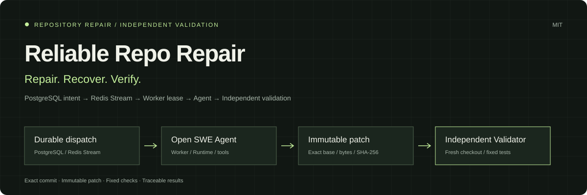
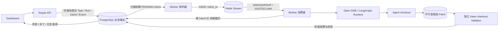
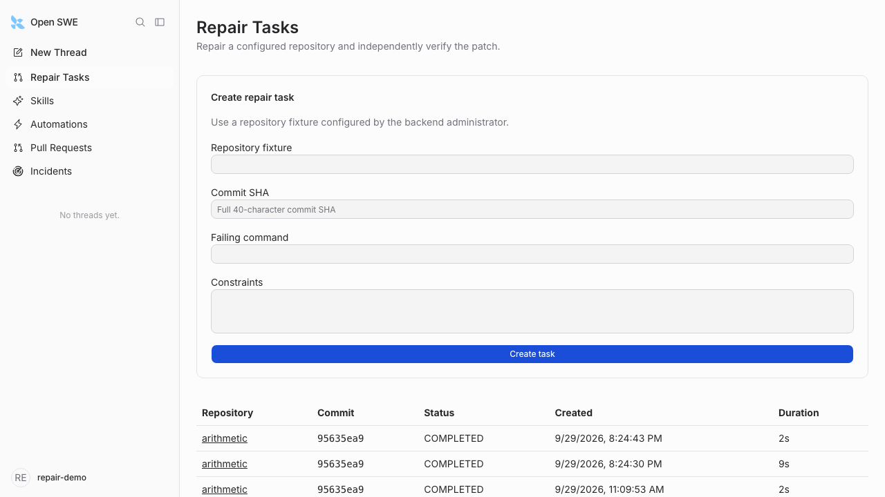
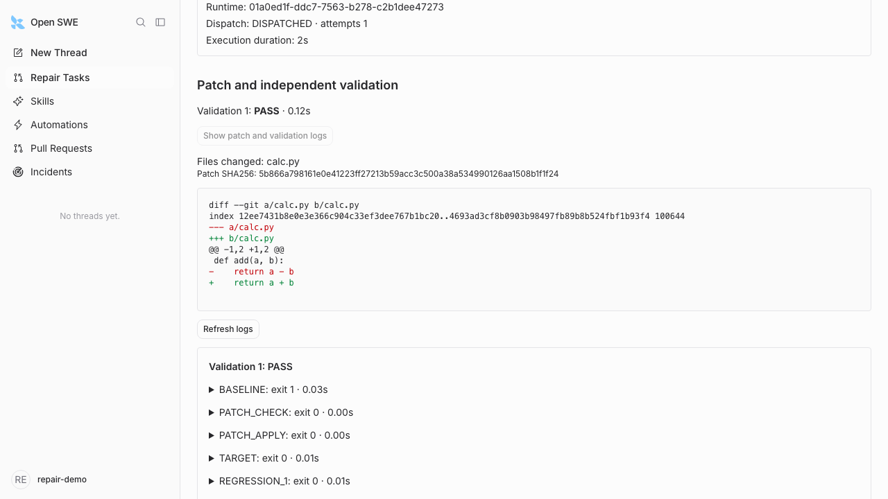

# Reliable Repo Repair

**把一次代码修复，变成可追踪、可恢复、可独立验证的任务。**

[English](README.en.md) · [项目介绍页](docs/site/index.html) · [项目功能](#项目功能) · [系统架构](#系统架构) · [快速启动](#快速启动)



Reliable Repo Repair 是一个集成任务管理、Agent 执行、补丁保存与独立验证的代码仓库修复系统。用户提交仓库 fixture、精确 commit SHA 和失败命令，系统完成任务派发、代码修改、候选补丁导出、干净环境验证，并提供状态、补丁与日志查询。

系统由 FastAPI、独立 Repair Worker、LangGraph Runtime、PostgreSQL、Redis Streams 和 React Dashboard 组成，使用五服务 Docker Compose 运行。

## 项目功能

| 功能 | 实现方式 |
| --- | --- |
| 任务可追踪 | Task / Run / Event 分离，记录业务状态、Runtime 关联与 deadline |
| 提交幂等 | `Idempotency-Key` + 用户归属；同 key 不同输入返回 `409` |
| 可靠派发 | Task / Run / DispatchIntent 同事务写入 PostgreSQL；Redis Stream 投递 Intent ID；数据库租约、token fencing 与有界重试约束执行 |
| 独立 Worker | API 与调度生命周期分离；Worker 负责派发、观察、收集候选、验证和恢复 |
| 不可变结果 | 精确 base commit、原始 patch 字节与 SHA-256 持久化，数据库约束候选记录不可变 |
| 独立验证 | 全新 checkout：复现原失败 → 检查/应用补丁 → 固定 target / regression；`PASS` 推进至 `COMPLETED` |
| 执行恢复 | Worker 重启后通过租约接管执行；Runtime 创建结果未知时按关联信息对账，token 和期限校验控制结果写回 |
| Dashboard | `/repair` 创建/分页列表；详情查看 timeline、Run、只读 diff 和验证日志 |

## 系统架构



API / Runtime 位于 `backend`；`repair-worker` 经 Runtime API 调用原 Agent，和 backend 共享本地工作卷。PostgreSQL 保存业务事实与派发意图；Redis Stream 交付 Intent ID，消费者回数据库取得执行租约。Runtime 保存 Agent 执行状态，各层通过 Task、Run、Intent 和 Runtime ID 关联。

| 服务 | 职责 |
| --- | --- |
| `dashboard` | 任务创建、分页列表、状态轮询、补丁与验证日志展示 |
| `backend` | session 认证、Repair API、数据库迁移与 LangGraph Agent Runtime |
| `repair-worker` | 持久派发、执行观察、候选收集、独立验证与租约接管 |
| `postgres` | 保存任务、Run、派发意图、事件、候选补丁与验证记录 |
| `redis` | Stream 消息、消费组与待确认消息接管；AOF 保存本地消息数据 |

PostgreSQL 持久保存 Intent，Redis Stream 按至少一次语义交付消息。`XADD` 失败时，`PENDING` Intent 重新发布；重复消息由数据库行锁与租约归并；消费者崩溃留下的消息由 `XAUTOCLAIM` 接管；Stream 丢失后，发布器从待处理 Intent 重建。Runtime 创建结果未知时，Worker 按 Runtime 元数据对账。

## 任务执行流程

1. **提交任务**：选择已授权 fixture，填写精确 SHA、失败命令和可选约束；API 校验输入及幂等键。
2. **事务入队**：在同一事务中保存 Task、首个 Run、DispatchIntent 和初始事件，返回 `202`。
3. **消息交付**：Worker 发布器扫描待处理 Intent，向 Redis Stream 写入 `intent_id`；消费者从消费组读取或接管消息。
4. **派发执行**：消费者按 Intent ID 回 PostgreSQL 领取租约，通过 Runtime API 启动 Agent，在独立工作区检出目标提交并修改代码。
5. **保存候选**：导出相对 base commit 的 patch，持久化原始字节、SHA-256 和修改文件列表。
6. **独立验证**：新建干净 checkout，复现原失败，检查并应用 patch，再运行固定 target / regression 命令。
7. **查询结果**：验证结果、命令输出与事件写回数据库，通过 Dashboard 或 API 查看最终状态与补丁。

成功路径：`RECEIVED → QUEUED → PROVISIONING → VALIDATING → COMPLETED`。`FAILED` 和 `TIMEOUT` 是终态；独立验证决定修复结果。

## 页面预览

以下为 `arithmetic` fixture 运行的实际截图，展示任务创建、补丁与验证结果。

| 创建与任务列表 | 补丁与验证证据 |
| --- | --- |
|  |  |

## 快速启动

从自己的仓库克隆后，在仓库根目录执行。需要 **Docker Compose v2** 和 **Python 3.9+**（仅用于生成私有配置）；业务 Python 3.14 和前端构建环境由 Dockerfile 提供。

```bash
# 仅首次执行；已有 .env.repair 时省略，保留原配置
python3 scripts/repair_init.py
docker compose --env-file .env.repair -f compose.repair.yaml up --build -d --wait --wait-timeout 180
```

启动 `postgres`、`redis`、`backend`、`repair-worker`、`dashboard` 五个服务。默认 UI：`http://127.0.0.1:3012/repair`；API / Runtime：`http://127.0.0.1:2032`。

内置 `arithmetic` fixture 使用确定性测试模型，执行 Agent 工具调用、代码修改、补丁导出与独立验证。

**运行内置修复示例：** 使用 Node 24.13.1 和 pnpm 11.22.0，安装浏览器依赖并复制本地私有 session：

```bash
pnpm install --frozen-lockfile --filter open-swe-dashboard... --filter open-swe --filter open-swe-e2e
pnpm --dir tests/e2e exec playwright install chromium
mkdir -p .tools/repair-demo
docker compose --env-file .env.repair -f compose.repair.yaml cp backend:/data/demo/session.json .tools/repair-demo/session.json
chmod 600 .tools/repair-demo/session.json
pnpm --dir tests/e2e exec node repair-tests/open-demo.mts
```

浏览器 helper 使用开发会话登录，并预填 `arithmetic` fixture、当前精确 SHA 与固定失败命令。点击 **Create task**，查看任务进入 `COMPLETED`，再打开 patch 与验证日志。

构建需要访问镜像与包仓库；配置、登录、代理、数据保留、重启及验收命令见 [部署指南](deploy/repair/README.md)。

## API 概览

所有接口使用 session 认证和用户归属校验；写请求受同源校验约束。

| 方法 | 路径 | 用途 |
| --- | --- | --- |
| `POST` | `/api/repair-tasks` | 创建任务；必需 `Idempotency-Key`，成功返回 `202` |
| `GET` | `/api/repair-tasks` | 用户自己的分页任务列表 |
| `GET` | `/api/repair-tasks/{id}` | 状态、Run、事件和验证摘要 |
| `GET` | `/api/repair-tasks/{id}/patch` | 原始 patch；响应包含 hash ETag 和 `X-Base-Commit` |
| `GET` | `/api/repair-tasks/{id}/artifacts` | 按需读取验证 checks / manifest，日志总输出上限 64 KiB |

创建参数为 `fixture_id`、40 位 `target_commit`、`failing_command` 和可选 `constraints`。fixture 由服务端配置并授权，失败命令与配置一致；仓库路径和验证计划由 fixture 管理。开发环境见 [Repair 开发说明](tests/repair/README.md)。

## 数据模型与执行记录

| 记录 | 保存内容 |
| --- | --- |
| `RepairTask` | 用户归属、输入摘要、状态、deadline 和验证计划 |
| `RepairRun` | 业务执行次数、thread / Runtime Run 关联、工作区和执行租约 |
| `DispatchIntent` | 派发状态、尝试次数、下次重试时间、owner、fencing token、最近一次 Redis Stream ID 和发布时间 |
| `RepairEvent` | 有序事件、阶段信息、关联 ID 和时间 |
| `CandidateArtifact` | base commit、原始 patch、SHA-256 和修改文件列表 |
| `ValidationRecord` | 候选关联、验证状态、各命令退出码、输出、耗时与环境摘要 |

Worker 使用数据库时间管理派发租约和任务 deadline。租约过期后由新 Worker 接管，token 校验确定当前结果写入权。Runtime 创建结果未知时，根据 thread 和 metadata 查询已有执行并恢复关联。任务超时进入 `TIMEOUT`，远端停止请求及其处理结果持久化在 Run 记录中。

## 补丁与独立验证

候选 patch 与精确 base commit 绑定，保存原始字节和 SHA-256。独立 Validator 从全新 checkout 执行以下检查：

| 检查 | 内容 |
| --- | --- |
| `BASELINE` | 在原始提交上运行目标命令，复现失败 |
| `PATCH_CHECK` | 检查 patch 能否应用到固定 base |
| `PATCH_APPLY` | 将保存的 patch 应用到干净工作区 |
| `TARGET` | 在修复后运行固定目标命令 |
| `REGRESSION` | 运行 fixture 配置的回归命令 |

验证记录保存 `PASS` / `FAIL` / `ERROR` 和每项检查的输出、退出码、耗时、截断与超时信息。`PASS` 将任务转为 `COMPLETED`；`FAIL` / `ERROR` 转为 `FAILED`。详情页提供只读 diff、验证摘要与按需加载的检查日志。

相关测试覆盖幂等提交、用户归属、Redis 发布失败与重复投递、消息接管与 Stream 重建、未知创建对账、候选 patch 重放、验证记录、Worker crash / restart 和浏览器修复链。Redis 增量的真实 PostgreSQL/Redis 相关测试 19 项通过，隔离五服务浏览器全链 1 项通过；证据见 [验收记录](docs/architecture/MVP_ACCEPTANCE.md)。

## 工程导航

```text
agent/repair/             Task、Run、派发、Adapter、Worker、独立 Validator
agent/resources/         原 Agent 资源与 Repair prompt
ui/src/features/repair/  创建/列表与详情页面
tests/repair/            Repair 单元、PG、Runtime 与恢复测试
tests/e2e/repair-tests/  浏览器验收与开发登录 helper
deploy/repair/           Dockerfile、启动入口与部署说明
compose.repair.yaml      五服务本地演示
docs/adr/                架构决策，含独立 Worker
docs/site/               无构建依赖的静态项目介绍页
```

开发约定见 [CONTRIBUTING](CONTRIBUTING.md)，环境和相关测试见 [Repair 开发说明](tests/repair/README.md)。数据模型、Redis 投递、派发与验证实现分别位于 [models.py](agent/repair/models.py)、[stream.py](agent/repair/stream.py)、[dispatch.py](agent/repair/dispatch.py) 和 [validation.py](agent/repair/validation.py)。

## GitHub 展示与发布

[开源发布指南](docs/OPEN_SOURCE_RELEASE.md) 包含仓库命名、About 文案、Topics、首次上传步骤与 GitHub Pages 配置。静态介绍页入口为 `docs/site/index.html`，可直接打开；手动触发的 `showcase-pages.yml` 仅发布 `docs/site/`，发布时自动绑定当前仓库与提交的文档链接。

## 来源与许可

本项目基于 LangChain 及其贡献者的 Open SWE，固定上游基线为 `ad545353e2cdb4c7ae1c419f966c82436b63e799`。保留上游 Git 历史、[MIT LICENSE](LICENSE)、原有第三方许可及 [原 README](docs/upstream-analysis/UPSTREAM_README.md)。

项目实现集中在 `agent/repair/`、Repair UI、数据库迁移、测试与部署配置；上游与增量的来源见 [ATTRIBUTION](ATTRIBUTION.md)。
