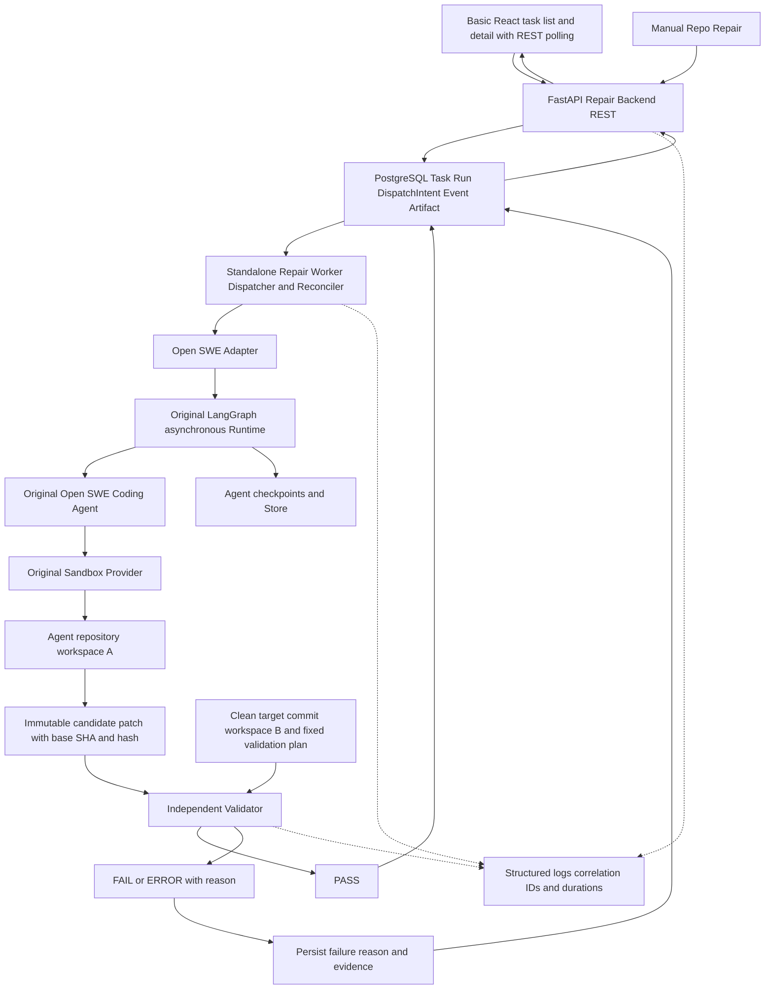

# Reliable Repo Repair Agent Backend Architecture

Upstream baseline: `langchain-ai/open-swe@ad545353e2cdb4c7ae1c419f966c82436b63e799`。设计日期：2026-09-28。

状态：**Python 优先，MVP-001 v1.0 可信本地范围已完成**；M0–M7 实际证据见 [ROADMAP](ROADMAP.md) 与 [验收对照](architecture/MVP_ACCEPTANCE.md)。本文还保留长期目标，明确延期功能不视为已实现。用户确认 Java 非必选并要求复用设施，因此采用原 FastAPI/PostgreSQL/LangGraph，保留业务控制与 Agent执行边界；Go仅为未来有具体需求时的备选。相关决策见 [ADR-007](adr/ADR-007-python-first-control-plane.md)、[ADR-008](adr/ADR-008-reuse-infrastructure-by-capability.md)。

核心业务契约见 [Task/Run、Dispatch、Recovery、Independent Validation](architecture/REPAIR_EXECUTION_CONTRACT.md)。当前先交付手动 Repo Repair，GitHub CI trigger 后加；Generation 与 Verification 分离。

当前开发范围以 [MVP-001 v1.0](MVP_DEVELOPMENT_PLAN.md) 为准。两个基本 UI 页面、REST 轮询纳入本版；下文完整状态/云策略/取消/CI/SSE/监控等为后续设计，不能自动加入当前实施。

## 目标架构（本版 MVP）

第一版为 Python 模块化应用：`agent/repair/` 承担业务控制与执行适配，FastAPI 仍由原 LangGraph Server 挂载，Agent graph 由原 Runtime 异步执行。不是把长任务放进 HTTP handler，也不假设单独启动 FastAPI 就能执行 graph。逻辑分层不要求 Java/Python 两套服务或新增 Go 服务；后续仅在部署和资源隔离确有需要时拆 repair dispatcher 进程。

PostgreSQL 应用数据与 Runtime checkpoint/Store 的配置、持久性分别验证；它们不因为都使用数据库就自动共享事务。dev in-memory/pickle 不作为生产 durability 保证。本版包括可重复本地 Compose 和基本 UI；Prometheus/Grafana 与生产部署专项明确延后。

## 现有基础与新增边界

| 处理 | 已有基础 | 新工作 |
|---|---|---|
| KEEP | `agent/server.py`、Deep Agents、LangGraph | 原 Coding Agent 与 graph，不复制 loop |
| KEEP | FastAPI、PostgreSQL/SQLAlchemy/Alembic | 新 feature 路由、模型和迁移 |
| KEEP | Repository、用户/workspace、鉴权基础 | RepairTask 所有权和 repo 授权检查；可信 fixture 单独绑定 |
| WRAP | SDK thread/run、异步 dispatch | RepairRun/attempt 与 thread/runtime run 关联、恢复、验证结果 |
| WRAP | Sandbox registry/lifecycle/providers | 精确 commit、workspace 保留、策略与 retention metadata |
| WRAP | transcript/stream、React diff/timeline | Repair 业务事件与页面；不完整复制 tool trace |
| MODIFY | 有限 factory injection、启动挂载、repair prompts | 仅真实 harness 所需 seam；保留原默认行为 |
| REMOVE | 无源码删除 | repair 配置按需不注册无关入口 |
| ADD | 当前没有 RepairTask 业务权威 | 状态机、dispatch intent、retry/cancel/deadline、独立验证、artifact/recovery |

原 `baby_sit.py` 只处理特定 PR watch，不能当作任意 CI failure 自动建 RepairTask。原 `reconcile.py` 的 stale-run 处理也不能替代业务恢复。

## 数据权威与事务

| 数据 | 权威 | Repair 保存内容 |
|---|---|---|
| task/status/deadline/retry/cancel/attempt | 新 Repair PostgreSQL 表与 service | 严格 enum、合法边、版本、执行租约 |
| messages/checkpoints/tool 内部状态 | LangGraph | thread/run/checkpoint references，必要查询投影 |
| repository/user/workspace | upstream 已有表 | 外键/身份引用；不新造重复 repository 或用户系统 |
| Sandbox filesystem 与实际资源 | Provider；thread metadata 绑定 | provider/id、观察状态、恢复窗口和策略 |
| validation 与 patch | Sandbox 独立执行/采集 | exit code、日志/patch reference、目标 SHA、验证摘要 |
| upstream transcript | 原 append-only log/projections | 原 trace 的引用；业务事件与状态原子写入新 repair history |

原 transcript middleware 有 best-effort 写入，不能成为 task 终态唯一依据。LLM 的最后一条文字或 graph success 不等于 COMPLETED。

创建事务写 `RepairTask`、首个 `RepairRun`、初始 event、`DispatchIntent`，返回 **202 + task id**。不等待 graph 或测试。dispatcher 用短事务认领 intent，事务外调用 SDK；成功后存 run reference。完成时在一事务中检查当前 attempt/token，写 validation/artifact metadata、event 与终态。patch/log 大内容可存 artifact 文件或对象存储，不机械镜像 checkpoint。

Phase 1 使用数据库唯一约束、原子 claim、最小 lease/token 与未知结果 reconciliation；Phase 2 完善 renew/fencing 与完整故障矩阵。DB claim 防并发，不代表外部 SDK 请求已被 fence。事务锁只覆盖数据库更新，不在模型或 shell 运行期间持有。跨 PostgreSQL 与 Runtime 创建 run 没有原子提交，不能承诺 exactly-once。

## 异步调度与故障窗口

优先复用 `agent/dispatch.py` 的配置构造与 SDK run API，使用原 `agent` graph；直接复用完整 dispatch 前须排查 Slack/通知副作用。adapter 只接受 validated 业务输入，禁止用户透传内部 runtime keys。

数据库提交后进程 crash：未完成 intent 被重新扫描。SDK 创建成功但 run id 尚未写回时 crash：按持久化 dispatch correlation 查找既有 run；发现 active run 则 observe，不再次启动。**已验证 SDK0.4.5 不支持 caller-specified run id**，所以持久化预生成 thread，再分页读取其 runs 并按 repair metadata 对账。多匹配明确失败；一次空查询不能排除在途创建，保留 RECONCILING，不盲目重发。三个真实 worker SIGKILL 窗口已通过；完整 checkpoint resume/Runtime crash 容灾仍未验证且延期，不能用 worker 接管替代。

没有 RabbitMQ consumer 时不宣称完成 RabbitMQ ACK/NACK、publisher confirm、DLQ/poison/redelivery 测试。业务 retry/backoff、失败归档与人工重试依然要实现。若这些场景需要独立 broker 或明确 MQ 专项练习，另加 RabbitMQ adapter；Redis 也只在具体并发/rate-limit/cache 缺口存在时引入。原始 MySQL/Redis/RabbitMQ 专项验收列为候选范围，不算 native runtime 已满足。

intent 使用 PENDING/CLAIMED/RECONCILING/DISPATCHED/FAILED，lease 过期不直接回 PENDING。具体字段、合法转移与重试分类见执行契约及 [ADR-010](adr/ADR-010-dispatch-lease-reconciliation.md)。

## Backend 状态机（完整目标；本版仅启用最小合法链）

完整 normal path：RECEIVED → QUEUED → PROVISIONING → REPRODUCING → DIAGNOSING → PATCHING → VALIDATING → COMPLETED；需人审时 VALIDATING → WAITING_REVIEW → COMPLETED。

| 事件 | 合法 source → target |
|---|---|
| accepted / ready to dispatch | 创建 RECEIVED；RECEIVED → QUEUED |
| execution claimed | QUEUED → PROVISIONING |
| checkout ready / failure confirmed | PROVISIONING → REPRODUCING；REPRODUCING → DIAGNOSING |
| observed edit / validation starts | DIAGNOSING → PATCHING；PATCHING → VALIDATING |
| independent validation fails, new repair budget remains | VALIDATING → RETRYING → QUEUED（新的 RepairRun；后续启用） |
| independently validated | VALIDATING → COMPLETED 或 WAITING_REVIEW |
| recoverable failure | 可重试活动状态 → RETRYING；RETRYING → QUEUED（新 attempt） |
| exhausted / permanent failure | 非终态（不含 CANCELLING）→ FAILED |
| deadline | 活动状态/RETRYING → TIMEOUT |
| cancel request / execution stopped | 非终态 → CANCELLING → CANCELLED |
| review approved | WAITING_REVIEW → COMPLETED |

终态 COMPLETED/FAILED/TIMEOUT/CANCELLED 不回退；手动 retry 创建 linked 新 task，自动 retry 在最终失败前发生。同 attempt crash 后 resume 保留已有 phase。状态变更只能经领域 service，不允许任意字符串更新。旧 lease/attempt 的迟到结果被拒绝。

本版仅展示可实际确认的 RECEIVED、QUEUED、PROVISIONING、VALIDATING、COMPLETED、FAILED、TIMEOUT；允许最小链 PROVISIONING → VALIDATING，不虚构诊断/修改事件。更细阶段后续启用并测试映射。

## 数据模型与查询

新增最小表：repair_task、repair_run、repair_dispatch_intent、repair_event、repair_artifact、repair_validation；引用原 Repository/workspace/principal 身份与 Runtime thread/run。可信本地 fixture 用明确配置身份，不把任意本地路径塞进 GitHub Repository 表。SandboxInstance、CIEvent、RunStep/ToolCall 查询投影按后续实际数据需要增加，优先读取原 trace 而非重复全量存储。

计划索引：task(repository_id, created_at, id)、(owner_id, created_at, id)、(status, created_at, id)；run(task_id, attempt_no) unique；intent(dispatch_id) unique 与待执行索引；event(task_id, sequence) unique；artifact(task_id, kind, created_at)。migration 遵守原 Alembic 和 `make migration` 流程，索引须真实查询验证。

支持最近任务、按状态分页、失败历史、task/attempt/tool trace、sandbox/patch 查询。repository 修复成功率与原始 CI 失败率分别定义；仅接收失败 webhook 的样本不能计算全部 CI 失败率。Phase 4 保存 **PostgreSQL EXPLAIN/EXPLAIN ANALYZE** 优化前后计划、数据规模、版本、参数与实测耗时；当前没有性能结果。若以后加入 MySQL，另做 MySQL 专项实验。

## Recovery 与 Sandbox

持久化 task/attempt/thread/run/commit/phase/checkpoint/sandbox references。恢复先查询原 run：active 则重接观察，ended 且 candidate 已保存则重接 Validator，允许 resume 才恢复执行。只有 checkpoint 且 sandbox 已删除时，明确 workspace loss，使用已有 snapshot/artifact 恢复或新 attempt；不能假装 filesystem 已恢复。

复用原 lifecycle 区分 unreachable 与 gone；暂不可达保留原 id，重连不能 force checkout 覆盖 patch。SandboxPolicy 覆盖 cpu/memory/disk/TTL、execution timeout、network、workspace isolation、secret scope、process cleanup；字段存在不等于 provider enforcement，逐项记录 supported/unsupported 与验证结果。

Phase 1 仅可信 fixture/per-task checkout，无 push/PR token。本地 shell 在 host 执行、普通 Docker 是本地容器执行，都不宣称云 Sandbox 强隔离。取消 run 不等于终止所有远程进程；清理/TTL 保留恢复窗口并单独实验。

## 独立验证

Agent generation 结束 →保存不可变 patch/base SHA/hash →新 clean checkout 复现 base failure →apply patch →固定 target/regression checks →PASS/FAIL/ERROR。agent 与 validator 可共用 Provider abstraction，但不能共用可变 workspace/依赖环境。Phase 1 用独立可信 fixture checkout；云 Validator 是否独立 provider root 待实验。

原 recovery patch 默认 merge-base，Repair 必须显式 exact SHA/path 并验证可重放性。Validator 无模型，独立持久化环境、exit/output、artifact、duration；baseline 未失败不能算修复成功。只有 PASS 且证据完整才完成；FAIL 与执行基础设施 ERROR 分别处理，Validator restart 不重启 Agent。详见 [ADR-009](adr/ADR-009-independent-clean-validation.md)。

## API、可观测性与鉴权

新 feature 拥有 `/api/repair-tasks` 路由：Phase 1 POST/GET/list，本版还包括 artifacts/patch；cancel/manual retry、SSE events 与 repository 专属查询明确延后。DTO/domain/ORM 分离，Pydantic validation、有限分页、稳定错误模型、Idempotency-Key 与版本语义。复用原 principal/auth/repo scopes 并检查 task ownership；无需先做完整 OAuth/GitHub App 或新 RBAC 系统。

统一 trace_id/repair_task_id/repair_run_id/runtime_run_id/thread_id；agent_sandbox_id 与 validator_sandbox_id/workspace_id 分别记录。结构化日志用 static message 与 extra；task id 不作高基数 Prometheus label。后续实现原要求的 task/run/queue/retry/sandbox/tool metrics 与小 Grafana dashboard，queue_wait 表示接受到实际执行的等待。本版结构化日志/IDs/耗时与基本持久化阶段 events 必做；metrics 平台/完整 trace/SSE 延后。未来 SSE 可复用传输经验，需明确 sequence/replay 与授权。

第一阶段不引入 Kubernetes、ELK、多租户、自动 PR。阶段完成以实际 unit/integration/fault test、git diff、ROADMAP 和 ADR 更新为准。

## 独立 Worker 收尾增量

[ADR-013](adr/ADR-013-standalone-repair-worker.md) 记录了独立 Worker 的四服务本地验收。当前五服务增加 Redis Streams：API 将 Task / Run / Intent / Event 同事务写入 PostgreSQL；Worker 发布 Intent ID 到 Stream，消费者回数据库领取租约，再经 Runtime API 调用原 Agent。真实模型实验和 Redis 增量验收分别记录在 [真实模型结果](architecture/REAL_MODEL_ACCEPTANCE_RESULTS.md) 与 [验收对照](architecture/MVP_ACCEPTANCE.md)；CI webhook 列在后续范围。
