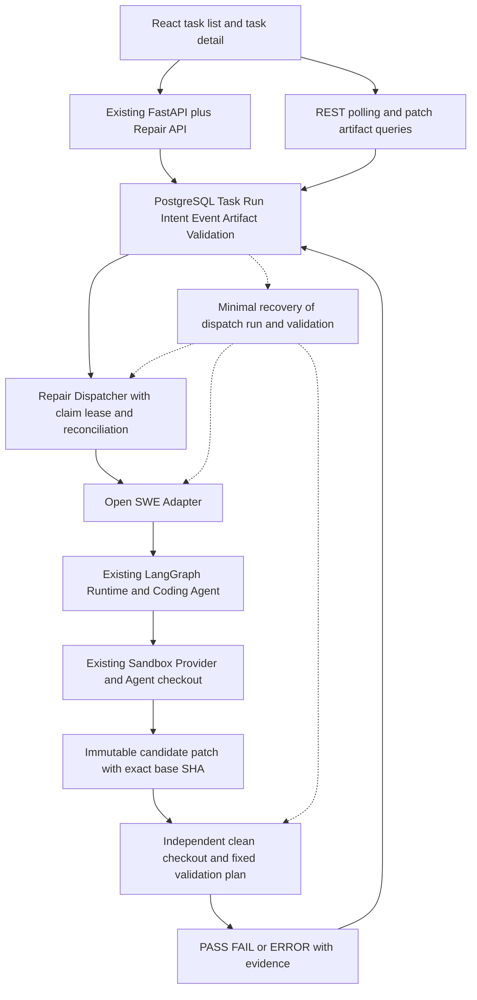

# Reliable Repo Repair Agent Backend — MVP 开发计划

- 计划编号：MVP-001
- 版本：1.0
- 固定日期：2026-09-28
- 范围状态：用户已确认，作为本版开发与验收依据
- 实施状态：M0–M7 已完成 MVP 可信本地验收，详见 ROADMAP 与验收对照；范围版本不变
- Upstream baseline: `langchain-ai/open-swe@ad545353e2cdb4c7ae1c419f966c82436b63e799`。
- 分支：`feat/ci-repair-backend`；基线 tag：`ci-repair-upstream-baseline`

## 1. 目标与适用范围

基于 Open SWE 的代码仓库修复 Agent 后端与可靠执行系统。复用原 FastAPI、PostgreSQL/SQLAlchemy/Alembic、LangGraph Runtime、Coding Agent、Sandbox abstraction/provider 和 React 基础，新增 Repair-oriented Backend Semantics。

本版交付 **核心后端 + 基本前端展示**。通过手动提交任务，完成可信测试仓库的修复、独立验证、结果持久化与查询展示。验收使用配置允许的固定 repository/fixture、精确 commit、固定失败命令及回归检查；不开放任意本地路径或通用 shell 平台。

所有模块为逻辑边界，不要求拆成多套服务。新业务主要位于 `agent/repair/`；不复制 Agent loop、不删除 upstream 功能、不隐藏开源来源。

## 2. 计划优先级与文档关系

本文件定义 **当前范围和验收条件**，优先于早期文档中更大的实现范围。文件级顺序见 [PHASE_1_PLAN](architecture/PHASE_1_PLAN.md)，技术契约见 [REPAIR_EXECUTION_CONTRACT](architecture/REPAIR_EXECUTION_CONTRACT.md)，源码事实见 [Upstream Audit](upstream-analysis/OPEN_SWE_ARCHITECTURE.md)。

旧架构中完整状态阶段、SSE、云 SandboxPolicy、CI ingestion、自动修复迭代、多 Provider 和监控平台均为后续设计，不自动进入本版。基本前端提前纳入 MVP，不能以“前端等 Phase 5”或“UI 可选”排除验收。

日常可逆实现选择在本范围内直接推进；遇到具体兼容问题先验证并做最小修复。恢复能力未经证明时保留明确未决/失败状态，不以盲目重复派发代替恢复。不承诺 exactly-once。

## 3. 本版必做功能

| 编号 | 模块 | 必做功能与边界 |
|---|---|---|
| F01 | RepairTask / RepairRun | 手动创建；输入验证；Task/Run 持久化；严格合法状态转移/终态保护；列表/详情；复用已有鉴权并检查 task ownership/repo scopes |
| F02 | DispatchIntent / Dispatcher | Task/首个 Run/Intent/初始 event 同事务；HTTP202 快速返回；异步 claim；PG unique 幂等；最小 lease/token；有限 safe retry/backoff；创建结果未知进入 RECONCILING 核对原 Run |
| F03 | Open SWE Adapter | typed 输入/config；真实原 graph API；thread/runtime run/agent sandbox 关联；观察执行与候选 patch；explicit repository/base SHA；不复制推理 loop、不接受用户内部 Runtime keys |
| F04 | Independent Validator | 保存不可变 candidate；独立 clean checkout；复现 base failure；校验 hash/base 并 apply；固定 target/basic regression；PASS/FAIL/ERROR、exit/output/timeout/environment evidence；模型不判 PASS |
| F05 | 最小 Recovery | 重启发现 PENDING/stale claim；核对并重接已有 Run；候选已保存则继续验证；Validator restart 不重启 Agent；旧 token/迟到结果不能覆盖新执行或终态；不可恢复有明确原因 |
| F06 | Artifact / Result /日志 | 持久化 patch、files changed、验证日志/摘要、failure reason、阶段 events；统一关联 ID；记录派发/执行/验证耗时与 retry count；大日志有可查询上限/存储 reference |
| F07 | 基本 React 前端 | 两页：列表含创建表单，详情含阶段/patch/validation/log；复用原路由、session、query 和组件；REST 定时轮询；loading/empty/error/终态展示 |
| F08 | 工程与测试 | Alembic migration；external config/无 secret 示例；可重复本地环境；focused unit/integration/fault tests；真实 graph + deterministic model；从零运行 README |

业务 normal flow、dispatch status 和 Agent 内部 state 分开管理，不将 LangGraph node/message 直接暴露为 task status。`repair_run_id` 与 `runtime_run_id` 分开；日志还含 `trace_id`、`repair_task_id`、`thread_id`、agent/validator workspace identities。

初次验收使用一个原 Provider 的可信本地执行路径；Agent 与 Validator 不共享可变工作区或依赖环境。本地 shell/普通 Docker 不宣称强安全云沙箱。仅实现本版必需的执行 timeout、任务总预算和失败记录，完整云资源/网络策略矩阵延后。

派发重试、验证恢复与新的代码修复尝试分别计数。本版实现有限的安全派发重试与同一 candidate 的恢复验证；不增加 Backend 自动多轮修复策略。原 Agent 自身的 Coding Loop 保留。独立验证 FAIL 或最终 ERROR 回写失败，保留证据；没有公共手动 retry/cancel 接口。

## 4. 基本前端范围

### 页面一：Repair Tasks（建议 `/repair`）

- 任务创建表单：允许的 repository/fixture、完整 commit SHA、失败命令、基本约束；提交成功显示 task id 并可进入详情。
- 列表字段：repository、commit、status、created_at、duration；基本分页与稳定排序。
- loading/empty/error 状态、表单验证、重复提交反馈；通过后端幂等兜底。
- 使用配置的轮询间隔（开发默认可设 3–5 秒），页面离开/隐藏时减少请求；不实现 SSE。

### 页面二：Repair Task Detail（建议 `/repair/$taskId`）

- 输入摘要、实际状态、已有阶段 events、Run references、耗时与失败原因。
- 修改文件列表、只读 diff、验证 PASS/FAIL/ERROR、目标/回归 checks 与日志。
- 结果未生成、验证执行中、失败/timeout、任务不存在与无权限均有明确展示；不虚构 phase timeline。
- 活动任务轮询，进入终态停止状态轮询；artifact 按需查询，不反复下载完整日志/patch。

复用现有 diff 基础组件；如果其产品数据耦合较重，先提供只读 unified diff。两种方式均须对应已保存的候选 patch，不能只展示 Agent 文本。不做交互式编辑器、复杂图表或独立新设计系统。

## 5. 最小 API 与数据边界

| API | 行为 |
|---|---|
| `POST /api/repair-tasks` | validated input + Idempotency-Key；事务成功返回 202、id 和 Location；不等待 Agent |
| `GET /api/repair-tasks` | 有界分页、稳定排序；仅返回 caller 有权访问的任务 |
| `GET /api/repair-tasks/{id}` | task/run/status/events 摘要、结果与失败原因；不存在 404，权限按原规范处理 |
| `GET /api/repair-tasks/{id}/patch` | 返回已持久化 candidate diff；未就绪明确返回状态，不能伪造空 patch 为成功 |
| `GET /api/repair-tasks/{id}/artifacts` | patch/log/validation metadata、前端所需的有界内容或复用的受授权读取引用；不得暴露内部文件系统路径 |

同一 owner/workspace + Idempotency-Key +相同 payload 返回原任务，不同 payload 返回 409。列表分页、commit/command 校验、统一错误 DTO 与权限覆盖 patch/artifact 查询。复用一种已有可运行的 auth/session 路径，初始化方式必须写入 README；不新增 OAuth/GitHub App 产品。

数据：repair_task、repair_run、repair_dispatch_intent、repair_event、repair_artifact、repair_validation；引用已有 Repository/身份，可信 fixture 使用显式配置。模型/DTO/domain 边界清楚，migration/index/事务经真实 PG 验证，不镜像整个 Agent checkpoint 或 ToolCall graph。

## 6. 当前明确不开发

下列项目全部标为 **DEFERRED：不进入本版实现或验收**：

| 类别 | 延后功能 |
|---|---|
| 自动 CI /交付 | GitHub webhook 自动触发、完整 GitHub App 授权、自动 Draft PR、自动 merge |
| 前端增强 | SSE、交互式代码编辑器、第三个独立 Patch 页面、统计图表、高级搜索、批量操作 |
| 调度增强 | 动态优先级、多种调度算法、配额、自动吞吐调节、多租户 |
| Agent 泛化 | 多 Agent 后端、动态模型路由、插件体系、Backend 自动多轮修复、全量 ToolCall 镜像 |
| 验证增强 | 多平台矩阵、自动测试选择、并行验证、复杂环境缓存 |
| 恢复/Provider | 全 Provider 自动恢复、跨云迁移、通用 snapshot 编排、完整容灾、复杂 SandboxPolicy 矩阵 |
| 公共控制 API | cancel、manual retry、repository 专属查询、单独 SSE events 接口 |
| 监控平台 | Prometheus/Grafana、集中式日志、完整分布式追踪；本版保留关联 ID/结构化日志/耗时 |
| 数据分析 | 性能 benchmark、查询优化前后 EXPLAIN 实验、复杂报表；本版仍需必要索引与正确查询 |
| 技术栈/部署 | 新 Java/Go 服务、新增 RabbitMQ/Redis/MySQL、Kubernetes、生产部署专项、复杂 RBAC |
| 非必要工程增强 | 独立 Artifact 管理平台、对象存储集成、版本搜索、额外业务微服务 |

“延后”不代表删除 upstream 已有能力。本版不额外改造这些功能，也不因已有某个接口就宣称 Repair 场景已验收。必要的最小 auth、超时、幂等、恢复与测试不能以“非核心”为由省略。

## 7. 实施顺序与里程碑

单元测试随所属模块开发，不等最后补齐。当前 M0–M7 DONE（本版可信本地范围）；具体证据见 [ROADMAP](ROADMAP.md) 和 [验收对照](architecture/MVP_ACCEPTANCE.md)，以下保留固定的验收定义。

| 里程碑 | 交付 | 退出证据 |
|---|---|---|
| M0：Runtime Gate | Python >=3.14/locked dependencies、PG 与原 Server、deterministic injection | 原 graph 真实 file/shell path 操作 fixture；SDK identity/query 契约记录；patch exact-base replay；无付费 LLM |
| M1：Task 与 API | schema/migration/state/domain/auth、POST/list/detail | 实际 PG 记录；HTTP202；非法转移、幂等、ownership 与 DTO tests |
| M2：持久派发 | intent claim/lease/token/backoff/reconciliation | 两 dispatcher 并发、未派发 crash、未知创建结果、旧 token 测试 |
| M3：Adapter/候选 | 原 graph 调用、关联 Thread/Run/Sandbox、immutable patch | exact SHA、真实工具修改、candidate hash 与可重放 artifact |
| M4：独立验证 | clean base →apply →固定 tests/regression →结果事务 | base fail/patched pass；wrong base/hash/apply、测试失败、timeout/ERROR 负例 |
| M5：最小恢复/结果 | 原 Run observe、candidate/Validator 恢复、query/log | restart 不盲目重建 Run；不重复 generation；迟到结果/终态保护 |
| M6：基本前端 | 两个页面、轮询、diff/validation/log、创建表单 | 浏览器创建任务并观察到真实结果；loading/error/终态停止轮询 |
| M7：端到端验收 | 本地 Compose、integration、README、阶段记录 | 新环境依文档复跑：前端→PG→Runtime/Agent→clean Validator→前端；测试实际 pass |

MVP 完成要求 M0–M7 全部通过。后端 API 跑通但前端缺失、只测 fake adapter、只检查 Compose config、跳过集成测试，都不能标 MVP DONE。

## 8. 测试与最终验收

至少覆盖以下可观察行为；每次只运行与变更相关的必要 checks：

- State/API：非法状态边、终态、请求校验、同 key 同/异 payload、分页、越权查询/artifact、重复完成。
- Dispatch：并发 claim、lease expiry、有限 backoff/exhausted、DB commit 后未派发、Run 创建后 reference 未落库、旧 token 迟到。
- Adapter：SDK typed contract 与真实原 graph harness；fixture fail/edit/candidate，mock adapter 不能替代真实 tool path。
- Validation：clean checkout、不受 Agent dirty workspace 影响、base 未失败、wrong SHA/hash、apply failure、固定测试失败、timeout/ERROR、验证证据持久化。
- Recovery：observer 重启重接原 Run、candidate 后 crash、Validator restart、sandbox gone/unreachable 分类及明确不可恢复原因；不承诺未验证的全部 checkpoint resume。
- Frontend：创建/list/detail/patch/result 的基本行为，活动轮询/终态停止；至少一次真实后端浏览器 smoke。
- Integration：真实 PG/API/dispatcher/Runtime/graph/Validator 的完整链；可使用现有 fixtures 或 Python Testcontainers，真实成本为零 LLM 调用；每项记录 pass/skip/fail。

最终验收证据包含：实际 Compose healthy 与日志、POST202/id、PG task/run/intent/events/results、原 Agent 工具调用、exact base candidate/hash、独立 clean validation、GET/前端展示、相关 tests、README 新环境复跑。性能/智能修复成功率没有实测就不写指标。

## 9. 工程规则、未知项与范围变更

遵守原 AGENTS：async-only、强类型、无新增 Any、feature-owned routers、prompts 放原 resources/prompts、`make migration`、静态日志 message + extra、不跑无关全量 tests。前端沿用 pnpm、TanStack 与现有格式/检查；route tree 按工具生成。

已验证：Python/容器/固定 lock、deterministic model 全路径 seam、run identity/metadata对账/在途创建窗口、exact-base patch、独立 checkout/stdlib依赖分离、最小 worker重启与普通容器重启保留结果。完整 Runtime crash/checkpoint/云 Sandbox 强隔离、复杂依赖矩阵与真实模型修复效果尚未验证且明确延期，不能由本版测试推断。未知项必须有证据后推进。

若固定基线或 Provider 无法完成本版核心能力，应记录具体失败、最小兼容修复和替代方案，不静默扩大技术栈或减少验收。日常实现不反复确认；新增明确延后功能/重大范围变化须更新本文版本、ADR/ROADMAP 并由用户确认。当前 v1.0 不包含未声明的增强功能。

相关：[ARCHITECTURE](ARCHITECTURE.md)、[ROADMAP](ROADMAP.md)、[ADR-011](adr/ADR-011-mvp-core-scope-basic-ui.md)、[验证记录](upstream-analysis/VALIDATION.md)。
