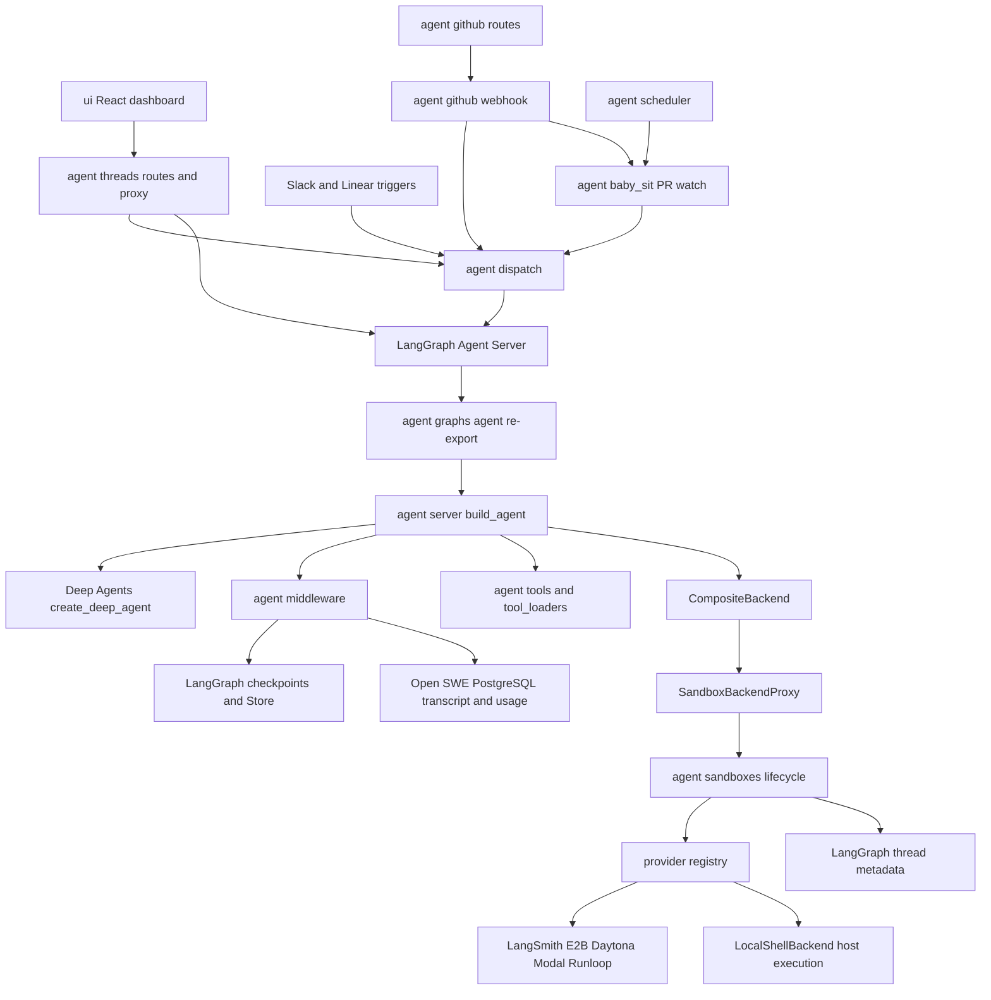

# Open SWE Upstream Architecture Audit

Upstream baseline: `langchain-ai/open-swe@ad545353e2cdb4c7ae1c419f966c82436b63e799`。审查日期：2026-09-28。

官方 remote：`upstream = https://github.com/langchain-ai/open-swe.git`。本地 tag：`ci-repair-upstream-baseline`。开发分支：`feat/ci-repair-backend`。机器可读记录：[baseline.json](baseline.json)。

当前下游实施范围固定为 [MVP-001 v1.0](../MVP_DEVELOPMENT_PLAN.md)：核心后端与两个基本 UI 页面；CI/SSE/高级监控等延后。本文源码事实仍对应同一 upstream SHA。

## 1. 审查范围、证据与结论边界

初始工作目录不是 Git 仓库，含其他面试资料；工程单独克隆到 `open-swe-ci-repair/`，没有触碰上级资料或 `sources/`。保留原仓库布局与历史，未做强制 monorepo 重排。

本报告依据此 SHA 的源码、配置和相关测试静态阅读，而非旧版 Open SWE 印象。下列路径均相对仓库根。阅读了 README、AGENTS.md、DEVELOPMENT、INSTALLATION 的运行配置章节、CUSTOMIZATION 的 Agent/Sandbox 配置章节、实际 graph factory、Sandbox lifecycle/providers/state、dispatch、FastAPI composition、thread creation/run/proxy、GitHub CI/webhook/baby-sit/scheduler、前端 API/提交路径及相关测试。生成的 `openwiki/` 只用作目录线索，不作为事实依据。未全量阅读每个模块，也未执行全套 upstream 测试。

**已确认**表示源码有证据；**设计**表示下游拟新增；**UNKNOWN**表示需实际调用、依赖安装或故障实验确认。静态代码证明有恢复路径，不证明任何云 provider 在本机已成功恢复。

## 2. Repository structure

```text
agent/
  graphs/                 graph entrypoint 的薄 re-export
  server.py               主 Coding Agent factory 与 middleware 组装
  runtime/                执行标记、配置绑定、常量
  middleware/             prepare/model/tool/transcript/guard/usage
  sandboxes/              lifecycle/state/paths/retry/repo_prep
    providers/            langsmith/daytona/modal/runloop/e2b/local
  api/                    FastAPI app/health/tracing/request IDs
  dashboard/              auth/session/settings 与 router 聚合
  threads/                creation/runs/proxy/diffs/terminal/access
  github/                 App/token/proxy/webhook/CI/PR/repository
  dispatch.py             durable run dispatch
  baby_sit.py             opted-in PR CI watch
  scheduler.py            确定性后台 graph
  database/               PostgreSQL + Alembic
  store.py                LangGraph Store access
  transcript/             append-only transcript 与 projection
  resources/prompts/      prompts
  tools/ tool_loaders/     定制 tools 与加载
ui/                       React/TanStack/Vite dashboard
cli/ desktop/             CLI 和实验性 Electron/local execution
openwiki/                 upstream 生成的证据索引
scripts/ tests/           工具、Python/前端/端到端测试
langgraph.json            6 graph + FastAPI + TTL config
langgraph.desktop.json    desktop graph/auth/SQLite checkpointer
pyproject.toml uv.lock     Python 包与固定依赖解
pnpm-workspace.yaml       ui/desktop/tests-e2e JS workspace
compose.yaml              原文件仅提供 PostgreSQL 16
Dockerfile                LangGraph Agent Server image 派生
```

本 SHA 的 `git ls-files` 为 1812 个路径，`rg --files tests` 为 390 个文件；这是目录盘点，不是测试用例数或测试覆盖率。

## 3. Key modules: 实际入口

| 关注点 | 源码定位 | 已确认行为 |
|---|---|---|
| Agent entry | `langgraph.json` → `agent.graphs.agent:traced_agent` → `agent/server.py:get_agent/build_agent` | graph factory 返回 Pregel；`traced_agent = get_agent` |
| Coding harness | `agent/server.py:build_agent` | 调用原 `create_deep_agent`，CompositeBackend、subagent、skills 与 middleware |
| Runtime | `agent/runtime/execution.py`、`agent/dispatch.py:create_durable_run` | server 注入执行上下文；dispatch 使用 sync durability、resumable stream |
| State | `agent/run_config.py:RunConfig`、`agent/middleware/prepare_run.py:PrepareRunState`、`agent/server.py:DesktopAgentState` | run config 不是业务状态机；消息与 prepare latch 由 graph checkpoint 保存 |
| Sandbox abstraction | `agent/sandboxes/state.py:SandboxBackendProxy` | Deep Agents `SandboxBackendProtocol/BaseSandbox`；async file/shell API |
| Lifecycle | `agent/sandboxes/lifecycle.py:ensure_sandbox_for_thread` | 创建/重连/credential refresh/绑定 metadata |
| Provider selection | `agent/sandboxes/providers/registry.py:create_sandbox` | 基于 `ENV.SANDBOX_TYPE` lazy import provider |
| Backend/API | `agent/webapp.py` → `agent/api/app.py` | FastAPI 被 LangGraph Server 挂载，不是 Spring/独立任务后端 |
| Dashboard routers | `agent/dashboard/routes.py`、`agent/threads/routes.py` | 聚合 `/dashboard/api`，auth 与 thread access 有产品语义 |
| GitHub | `agent/github/routes.py`、`webhook.py`、`token.py`、`sandbox_access.py` | webhook HMAC、workspace routing、App/OAuth/token scope、PR |
| CI monitor | `agent/baby_sit.py`、`agent/github/ci.py`、`agent/scheduler.py` | 对主动开启 watch 的 PR 监控并唤醒原 thread |
| Tool system | `agent/tools/`、`agent/tool_loaders/`、`agent/middleware/dynamic_tools.py` | Deep Agents 基础 file/shell tools + upstream curated/custom/integration tools |
| Configuration | `agent/config.py`、`RunConfig`、dashboard options/settings | 环境变量 + run config + thread/profile/workspace/default 层级 |
| Tests | `tests/agent/`、`tests/runtime/`、`tests/sandbox/`、`tests/github/`、`tests/e2e/`、`ui/**/*.test.*` | pytest/asyncio/mock + Postgres fixture、Vitest、Playwright |

**文档漂移**：README 写五个 graph；实际 `langgraph.json` 有六个，额外 `review-scout`。`langgraph.json` 使用 API `>~=0.15.0rc1`，pyproject constraints 使用 `>=0.15.0rc1,<0.16` / runtime `>=0.35.0rc1,<0.36`；根 Dockerfile 和 desktop config 仍写 API `0.13.3`。不能假设这些启动入口相互兼容。`uv.lock` 实际固定 `langgraph-api=0.15.0rc5`、`langgraph-runtime-inmem=0.35.0rc5`、`langgraph=1.2.12`、`langgraph-sdk=0.4.5`，并非只看range。

## 4. Code-level module relationships



这张图表达调用/数据依赖，未把 `agent/graphs/` 当成独立 Agent 实现，也未把 SDK 当成独立 reasoning loop。

## 5. Execution flow

1. Dashboard、GitHub、Slack、Linear、automation 形成输入与配置。Dashboard 可走 commands/stream proxy；webhook 等走 `dispatch_agent_run/create_durable_run`。
2. 创建/使用 LangGraph thread，设置 title、actor、repository、workspace 等 metadata。
3. LangGraph run 通过 `assistant_id` 选择 graph；`agent` 路由到主 factory。
4. `build_agent` 检查 thread_id 与 `__is_for_execution__`。没有执行标记时返回空 prompt/tools 的 graph，供 schema/state 读取。**直接手工调用 factory 而忽略上下文可能“得到 graph 但没得到 Coding Agent”。**
5. 建立可延迟重连的 sandbox proxy；加载 thread/profile/workspace/model/permission/integration 配置。
6. 原 `create_deep_agent` 组装 file/shell tools、custom tools、skills、subagent、middleware。
7. `PrepareAgentRunMiddleware` 构造工作目录、系统 prompt、身份/来源/上下文；desktop 分支走本地 allowlisted project。
8. model → tools → model 迭代由 Deep Agents/LangGraph 执行；LangGraph checkpoint、transcript、usage 各有自己的写入路径。
9. Agent 按产品 prompt/tools 可推送代码/创建 PR；结果不是我们定义的 `RepairResult`。**run success 不等于 CI validation passed**，下游必须独立验证并产出 typed result。

普通 coding 路径中 repo 准备与 reviewer 不同：`prepare_review_repo` 是 reviewer 的确定性 clone/checkout，使用 `git checkout --force` 且 best-effort 返回布尔值。不能原样用于有未提交 patch 的 repair resume。Repair 首次 clone/精确 SHA 校验应由 worker/adapter 确定性完成；resume 不能 force checkout 或重新 clone 覆盖工作。

## 6. State flow 与持久化边界

| 数据 | upstream owner | 下游用途与注意事项 |
|---|---|---|
| messages、tools、todos、prepare latch | graph/checkpointer | 复用；不把整份 checkpoint 镜像到业务表 |
| `RunConfig` | SDK/config + factory | Pydantic `extra=allow`、全部 optional、容错 drop 无效字段；下游输入要严格 DTO 验证 |
| thread identity/status/metadata | LangGraph Server | 一个 thread 可有多次 run；业务 task status 不可直接映射 thread busy/idle |
| sandbox id | thread metadata `sandbox_id` | 云重连权威依据；下游保存 projection/reference |
| users/workspaces/repositories/reviews/transcript/analytics | upstream PostgreSQL/Alembic | 不能把 `POSTGRES_URI` 改成 MySQL URI；明确 source-of-truth |
| PR CI watches/settings | LangGraph Store +相关 DB feature | upstream PR-centric watch，不是 RepairTask |
| backend repair lifecycle | **不存在** | 下游 PostgreSQL 新建 repair task/attempt/event/artifact；Agent checkpoint 独立 |

`BasePrepareRunMiddleware` 的 `run_prepared_for` latch checkpoint 后可跳过已完成初始化，但不保证任意 clone/test/patch shell 命令 exactly-once。恢复跨越 shell side effect 与 checkpoint 的窗口时须做应用级 reconcile。

`agent/store.py` 直接经 `get_client().store` 读写；factory、metadata 与 StoreBackend 依赖 Server 注入，`bindable_config` 还主动过滤 `__pregel_*` 避免绑定错误 runtime。故独立 `ainvoke` + 一个 SQLiteSaver 不是经源码确认可用的替代部署。

## 7. Sandbox flow 与 provider matrix

`ensure_sandbox_for_thread`：读取 thread metadata → 查 cached connection → provider reconnect → 更新代理凭证/身份 → 完成初始化后绑定 sandbox_id → 发布 backend proxy。

| Provider | 当前创建/重连接口 | 资源/持久性事实 | 下游结论 |
|---|---|---|---|
| LangSmith（默认） | `create_langsmith_sandbox`、`LangSmithProvider.get_or_create` | 显式 CPU/memory/fs/idle TTL/delete-after-stop/snapshot 参数；Async SDK；已删 404 → SandboxGoneError | 首期云能力研究对象；实际账号/配额/网络/恢复 UNKNOWN |
| E2B | `Sandbox.create/connect` → `E2BSandbox` | API key、template、代码固定 3600 秒 timeout | 可重连接口存在；崩溃/TTL后保留与恢复须实验 |
| Daytona | `daytona.create/get` → `DaytonaSandbox` | snapshot + API key | wrapper 有重连接口；资源与删除语义未统一 |
| Modal | `Sandbox.create.aio/from_id.aio` | async provider | 同上，不推断文件跨删除恢复 |
| Runloop | `devboxes.create/retrieve` | bearer token | 同上 |
| local | `create_local_sandbox` → `LocalShellBackend` | sandbox_id 被忽略；一个环境变量 root；在 host 执行，无隔离 | 不能依靠 sandbox_id 隔离多任务，也不是 Docker provider |
| desktop/local path | `agent/desktop.py:create_desktop_backend` | source=desktop；project allowlist/worktree path；本地 shell | 可作可信 fixture 接入实验；shell 仍不构成强隔离 |

registry 资源参数主要针对 LangSmith，其他 provider 不等价支持；不能设计统一 SandboxPolicy 后假设每个字段已被 enforce。

**恢复分类**：暂时不可达 → `SandboxUnreachableError`，coding 默认不 replacement；确认已删除 → `SandboxGoneError`，会 replacement；read-only reviewer 可 `allow_replacement=True`。这比 README/局部 AGENTS 的简短说明更细。Backend 应将 deletion 记录为 workspace loss，停止透明 resume；从保存的 patch/snapshot 恢复或开启新 attempt，必须说明失去的工作。

持久 metadata 不等于持久 filesystem。新 sandbox 初始化完成前没有绑定 ID，crash 可留下 orphan；SDK create 是否支持 idempotency、能否按 task label 查找回收：**UNKNOWN**。LangSmith provider intentionally 没有统一 delete；upstream 依赖平台 TTL 回收，不应增加“task 结束即删”导致重连中任务丢失。

## 8. GitHub flow / CI monitoring

`/webhooks/github` 验证 `X-Hub-Signature-256` → 记录 EventLog → 校验支持事件 → workspace ownership 路由（未知时 503）→ repo/actor gate → background processing → graph dispatch。

本 SHA 支持 `check_run/check_suite/workflow_run/status`；`agent/github/ci.py` 解析 branch/head SHA、分页获取 check/status、required checks、排除 Open SWE 自己的 checks，并识别 `failure/timed_out/action_required`。`agent/baby_sit.py:handle_ci_webhook` **仅匹配已开启的 active PR watch**，使用 delivery IDs/dispatch keys 去重，锁由 TTL LangGraph lock-thread 实现；scheduler 的 baby-sit tick 也评估这些 watch 并 `enqueue` 唤醒原 thread。

这不是“任意 repository 的 workflow failure 自动创建独立 RepairTask”。不能直接把 baby-sit watch 改名成 RepairTask。可复用解析与 CI read helpers；重做 ingestion、业务幂等键、job/log 收集、预算与结果语义。failed job 原始日志的下载/脱敏/大小限制在拟定路径尚未构成下游稳定 API，标记 UNKNOWN，Phase 3 专门实现/验证。

已有 `open_pull_request`、workflow push guard、credential proxy/scope 等需要保留。新入口默认没有 push/PR 能力；仅 prompt 禁止 push 不足以作为权限边界。Phase 1 的无 token fixture + 去掉 remote push 通道仅用于本地测试。

## 9. Frontend/backend interaction 与耦合

`ui/` 使用 React 19、TanStack Router/Query、Vite；不是可直接复用的独立 Repair Dashboard。`ui/src/lib/langgraph-client.ts` 构造 `@langchain/langgraph-sdk` client；`ui/src/features/agents/lib/api.ts` 使用 `/dashboard/api`；`provider/useSubmitAgentMessage.ts` 经 thread source 发起 `run.start`；`agent/threads/proxy.py` 转发 `/threads/.../stream/events`、commands、runs 等。

UI 同时依赖 upstream thread/transcript shape、v3 stream、cookie/OAuth、repo/workspace settings；FastAPI 同时依赖内部 LangGraph API、Store、PostgreSQL。**耦合程度高**，新增业务 API 不能用换一个 API_BASE 的方式完整接管原 UI。本版复用 diff/样式组件，新增 repair API client 与两个基本页面；SSE/高级 timeline 后续再做；原 upstream 页面先保留。

`swagger.json` 只覆盖 custom FastAPI，不覆盖运行时 `/runs /threads /assistants`。不能用它生成完整 worker client。Repair API 独立版本化，不暴露 SDK 内部 keys。

## 10. KEEP / WRAP / MODIFY / REMOVE / ADD

| 决策 | 模块/能力 | 用途与边界 |
|---|---|---|
| KEEP | `agent/server.py` 主 loop、Deep Agents、LangGraph runtime | 复用真实 Coding Agent，不复制 reasoning loop |
| KEEP | `agent/middleware/` 的 model/tool sanitization、guards、prepare、usage | 保留成熟执行行为；按 repair 入口过滤外部副作用 |
| KEEP | `agent/sandboxes/` +云 providers | 保留 abstraction 与重连；按 provider 验证 policy enforcement |
| KEEP | GitHub App/token/proxy/PR/CI read helpers | 为 Phase 3 复用；Phase 1 不要求完整授权 |
| KEEP | `ui/`、tests、LICENSE、所有第三方 licenses | 不删除原产品；保留前端基础与来源 |
| WRAP | graph run API / SDK | Python RepairAgentAdapter 管 start/observe/result；复用原 graph |
| WRAP | sandbox lifecycle | policy、metadata projection、可达/已删区别、artifact retention |
| WRAP | agent messages/tool events | 转成 backend RunStep/ToolCall/RepairEvent；LLM文字不推进权威状态 |
| MODIFY | repair graph/config entry（增量）、有限 factory injection seam | 仅在 Gate 1 证明 fake model/本地测试所需后增加；默认 upstream 行为保留 |
| MODIFY | 新 repair prompt、tool allowlist、确定性 clone/validate | patch-only；prompt 不冒充权限控制；原 reviewer force checkout 不复用为 resume |
| MODIFY | 本版两个基本 UI pages + repair client、README/本地部署 | 复用基础组件，改变业务视图 |
| REMOVE | **本阶段无源码删除** | Slack/Linear/reviewer/analyzer/desktop 仅可在 repair runtime 配置中不注册；较大删除另做依赖审查 |
| KEEP | FastAPI/PostgreSQL/Alembic、auth/principal/Repository | 原应用与数据基础；增加任务授权检查 |
| ADD | Python `agent/repair/` | task/attempt/state/REST/dispatch intent/adapter/validation/recovery |
| ADD | repair tests 与 fixture | deterministic model +真实 graph/tool harness |
| ADD | `deploy/`、契约/故障 tests、migrations、observability | Compose 与可验证可靠执行，按阶段推进 |

## 11. 最小侵入接入点与 Python 最小 API

首选 **Server/SDK boundary**：原 FastAPI 新 Repair feature → PostgreSQL task/dispatch intent → Python dispatcher/adapter → 原 LangGraph Server 的 `agent` graph。业务与 Agent 状态逻辑分层，不新增跨语言后端。2026-09-28 用户允许 Python/Go 并要求最大复用；当前设计见 ADR-007/008。

从源码确认的最小调用序列（设计，不是已跑通示例）：

```python
from langgraph_sdk import get_client

client = get_client(url=runtime_url)
await client.threads.create(
    thread_id=thread_id,
    if_exists="do_nothing",
    metadata={"title": title, "repair_task_id": task_id},
)
# input/config 由 adapter 严格构造，不接受用户透传内部 runtime keys。
run = await client.runs.create(
    thread_id, "agent",
    input={"messages": [{"role": "user", "content": repair_prompt}]},
    config={"configurable": run_config},
    durability="sync",
    multitask_strategy="reject",
    stream_resumable=True,
)
# 持久化 run_id 后独立观察 status/state/stream，完成独立 validation。
```

这里直接使用 SDK 避免复用 dispatch 的 Slack reply/feedback/workspace 通知等外部产品副作用。Server 仍加载真正 `agent/server.py`。字段签名以锁定安装后的 SDK 契约测试为准；`reject` 的冲突处理、run_id 确定性、resume 输入为 None / command 的准确语义均需 Gate/Phase 2 实际验证。

可选直接 Python entry 是 `await agent.graphs.agent.get_agent(config)` 返回 graph；但不能把 `__is_for_execution__`、Store/client/checkpointer 私有 runtime 拼装当成稳定公开 API。本阶段不采用该捷径，也不复制 `create_deep_agent` 工厂。**最小可用 fake model 接入方式 UNKNOWN**：现 factory 无公开 model 参数，需在隔离 repair entry 中提供明确 typed injection seam，覆盖 main/title/subagent/offload/fallback 全模型路径，避免测试意外发昂贵调用。猴子补丁仅用于测试，不作为生产 adapter。

**本地 fixture 候选**：source=desktop + Runtime 可访问的每任务 checkout 路径 + `OPEN_SWE_LOCAL_PROJECTS_FILE` allowlist。这只是验证本地能力的适配，保留 `repair_task_id` 业务来源，不能对外宣称 desktop source 就是云 repair。部署在独立无特权容器中改善 host 边界，但容器不是强安全 Sandbox；云模式后续恢复原 provider 路径。

### Patch collection 的复用边界（补充源码审查）

已阅读 `agent/resources/recovery_patch.py` 与 `agent/threads/diffs.py`：原路径支持 binary/full-index、普通 untracked files 的 patch 导出/download，但 `merge_base()` 按 branch/main/master/HEAD~1/fallback 寻找 base，`find_repo()` 扫描目录。它不是基于 RepairTask exact commit/path 的独立验证器。Repair 拟复用导出机制并加 explicit base/path seam，默认 upstream dashboard 不变；具体 patch 类型覆盖与 clean replay 仍 UNKNOWN。验证器需独立 checkout/apply/固定测试，不能直接采纳原 Agent workspace 的自报结果。详见 [执行契约](../architecture/REPAIR_EXECUTION_CONTRACT.md)。

## 12. 目标架构差异与主要风险

| 主题 | upstream | 下游目标/风险 |
|---|---|---|
| 产品 | 软件工厂、PR review、跨渠道 | CI failure → repair；产品语义须专用 |
| Control Plane | FastAPI + LangGraph API + PostgreSQL | 复用 FastAPI + PG，新增 repair feature；保留原 runtime |
| Queue | LangGraph Server 内部执行 queue | PG dispatch intent +原 graph scheduling；业务 retry 独立设计 |
| State | thread/run/agent checkpoint/transcript | 严格 backend enum 状态机与 attempt/run references |
| Sandbox | thread metadata + process caches | backend projection/lease/fencing/recovery/retention |
| 成功 | graph run success/PR delivery | clean base/apply candidate +固定 command exit + exact SHA/hash + validation evidence |
| UI | graph SDK/thread stream | repair REST/SSE；组件复用，不强行复用整体 API |
| DB | PG专用 SQL/JSONB/Alembic + Store | 复用 PG/Alembic/Repository；新 repair 表，避免重复权威数据 |

主要风险，按优先级：

1. **运行版本漂移（高）**：Python 3.14、Deep Agents pin、LangGraph RC、Docker/API config 不一致；E2B 依赖还靠 uv override 跨版本。先在固定 SHA 上证明 locked install、Graph Server 和 fake model工具链。
2. **隐藏 Server/Store/PG依赖（高）**：FastAPI lifespan require Postgres；SDK get_client 与 graph内部状态深耦合。PG 专用 SQL 不能靠换 URI 迁移；ADR-008 保留 PG，生产 Runtime 配置仍单独验证。
3. **fake不等于真实 harness（高）**：mock adapter端到端通过不能证明真实 Open SWE；必须另有真实 graph + deterministic model +真实file/shell fixture测试。
4. **状态与副作用窗口（高）**：dispatch重复、dispatcher/Server分别 crash、run创建后reference未落库、shell执行后 checkpoint 前 crash，必须分别处理；不宣称 exactly-once。
5. **Sandbox不可达/删除（高）**：目前 deletion 会新建；checkpoint 可能引用已消失的文件。backend需显式失败或restore，不透明继续。
6. **本地隔离（高）**：local provider共享 env root且忽略 id；desktop shell不是强隔离。不可把 携带服务凭证的 Runtime 容器变成默认不可信repo沙箱；Phase1只用可信fixture，云模式再切 provider。
7. **自动外部副作用（高）**：tools 与system prompts倾向PR/push/slack；repair入口须收敛权限、token scope与tool set。
8. **event loop/process globals（中高）**：`SANDBOX_BACKENDS/CONNECTIONS` 与 Async SDK handle loop-affine；upstream 强制 `BG_JOB_ISOLATED_LOOPS=false`。不要每次dispatch建新loop，不跨process传backend对象。
9. **高耦合 factory（中）**：`server.py` 超过1700行，读多层settings与产品integrations；扩展用小seam +wrapper，避免复制后双份维护。
10. **产品事件非权威（中）**：transcript writes best-effort，日志/stream缺失不等同执行失败。Repair业务事件与权威状态需要自己的事务和去重。
11. **云策略差异（中）**：API key/TTL/resources/proxy/cleanup未统一，CPU/memory/network配置支持不能推断实际隔离保证。
12. **生产 deployment gate（中）**：README明确self-host Agent Server需要 license key；不能宣称无条件免费production self-host，不能把 dev server当production。

## 13. Tests 与审查后的实验计划

有源码回归覆盖：`tests/runtime/test_bindable_config.py`（runtime keys）、`tests/sandbox/test_sandbox_state.py`（proxy）、`test_sandbox_recovery.py`/`test_sandbox_recreation.py`（恢复与replacement）、`tests/agent/test_local_checkpointer.py`（SQLite导入）、`test_agent_assembly_context.py`（factory组装mock）、`tests/github/test_github_ci.py`（CI解析/分页）、`test_baby_sit_webhook.py`（watch触发）、`tests/dashboard/test_dashboard_run_enqueue.py`（enqueue）。阅读测试不等于这些测试已通过，也不等于有真实 provider/真实 LLM 实验。

`tests/conftest.py` 会导入大量upstream模块；相关数据库测试依赖 `TEST_ANALYTICS_POSTGRES_URI`，未设置时可skip。必须报告pass/skip/fail与环境，不能把skip当通过。CI用PG16，原项目没有新 RepairTask 完整集成链；MySQL/Redis/RabbitMQ 专项实验仍未完成，当前 native 方案测试真实 PG/Runtime。

Phase 0 验证与命令结果见 [VALIDATION.md](VALIDATION.md)。Phase 1 从最窄的 runtime gate开始，详见 [PHASE_1_PLAN.md](../architecture/PHASE_1_PLAN.md)。本阶段不会删除原功能，也不会因纸面方案完整就宣称Vertical Slice已完成。

## 14. 固定SHA的关键源码链接

- [Agent factory: agent/server.py:1123](https://github.com/langchain-ai/open-swe/blob/ad545353e2cdb4c7ae1c419f966c82436b63e799/agent/server.py#L1123)
- [Agent entry: agent/server.py:1744](https://github.com/langchain-ai/open-swe/blob/ad545353e2cdb4c7ae1c419f966c82436b63e799/agent/server.py#L1744)
- [Execution context check: agent/runtime/execution.py:6](https://github.com/langchain-ai/open-swe/blob/ad545353e2cdb4c7ae1c419f966c82436b63e799/agent/runtime/execution.py#L6)
- [Durable dispatch: agent/dispatch.py:248](https://github.com/langchain-ai/open-swe/blob/ad545353e2cdb4c7ae1c419f966c82436b63e799/agent/dispatch.py#L248)
- [Sandbox lifecycle: agent/sandboxes/lifecycle.py:383](https://github.com/langchain-ai/open-swe/blob/ad545353e2cdb4c7ae1c419f966c82436b63e799/agent/sandboxes/lifecycle.py#L383)
- [Sandbox proxy and metadata: agent/sandboxes/state.py:56](https://github.com/langchain-ai/open-swe/blob/ad545353e2cdb4c7ae1c419f966c82436b63e799/agent/sandboxes/state.py#L56)
- [Provider registry: agent/sandboxes/providers/registry.py:23](https://github.com/langchain-ai/open-swe/blob/ad545353e2cdb4c7ae1c419f966c82436b63e799/agent/sandboxes/providers/registry.py#L23)
- [Local provider: agent/sandboxes/providers/local.py:38](https://github.com/langchain-ai/open-swe/blob/ad545353e2cdb4c7ae1c419f966c82436b63e799/agent/sandboxes/providers/local.py#L38)
- [PR CI watcher: agent/baby_sit.py:546](https://github.com/langchain-ai/open-swe/blob/ad545353e2cdb4c7ae1c419f966c82436b63e799/agent/baby_sit.py#L546)
- [FastAPI startup: agent/api/app.py:32](https://github.com/langchain-ai/open-swe/blob/ad545353e2cdb4c7ae1c419f966c82436b63e799/agent/api/app.py#L32)
- [PostgreSQL requirement: agent/database/postgres.py:58](https://github.com/langchain-ai/open-swe/blob/ad545353e2cdb4c7ae1c419f966c82436b63e799/agent/database/postgres.py#L58)
